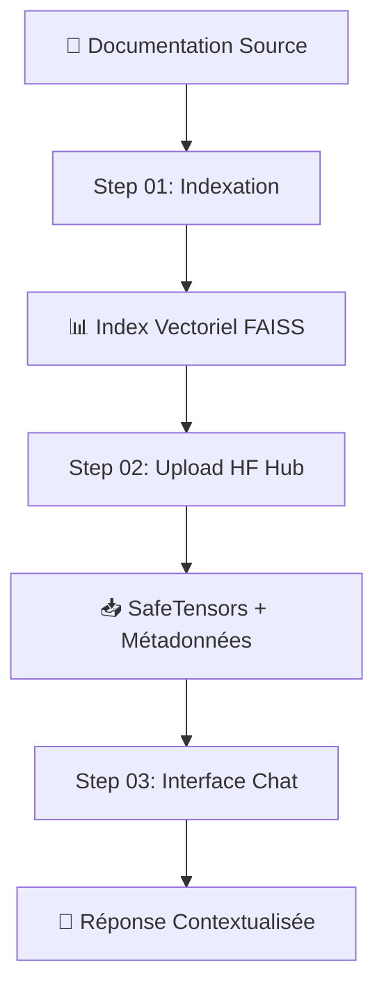

# 🔍 LocalRAG - Système RAG Local Complet

## Vue d'ensemble

LocalRAG est un système de **Retrieval-Augmented Generation (RAG)** entièrement local, conçu pour indexer et interroger efficacement de la documentation technique. Le système fonctionne en plusieurs étapes orchestrées pour offrir une recherche sémantique haute performance sans dépendance cloud.

## 🏗️ Architecture du processus



## 🚀 Installation et prérequis

### Prérequis système
- **GPU requis** : CUDA (NVIDIA) ou MPS (Apple Silicon)
- **Python** : 3.8+
- **RAM** : 8GB minimum, 16GB recommandé
- **Stockage** : 10GB+ selon la taille de la documentation

### Installation
```bash
# Cloner le repository
git clone https://github.com/user/LocalRagModel.git
cd LocalRagModel

# Installer les dépendances
pip install -r requirements.txt

# Vérifier l'installation GPU
python -c "import torch; print(f'GPU disponible: {torch.cuda.is_available() or torch.backends.mps.is_available()}')"
```

## 📋 Étapes du processus

### ✅ **Step 01 - Indexation** (`step01_indexer.py`)
**Statut**: ✅ Implémenté et optimisé

Transforme la documentation brute en index vectoriel searchable.

### ✅ **Step 02 - Upload Embeddings** (`step02_upload_embeddings.py`)  
**Statut**: ✅ Implémenté, testé et optimisé

Convertit l'index FAISS en SafeTensors avec structure de métadonnées améliorée et upload vers Hugging Face Hub.

### ✅ **Step 03 - Interface Chat** (`step03_chatbot.py`)
**Statut**: ✅ Implémenté, optimisé et entièrement fonctionnel

Interface de chat Gradio avec streaming utilisant les embeddings de Step 02 et génération Qwen3-4B-Instruct-2507.

---

## 🚀 Step 01 - Indexation Vectorielle

### 🎯 **Objectif**
Convertir la documentation technique (HTML/Markdown) en représentations vectorielles pour permettre une recherche sémantique ultra-rapide.

### 📊 **Pipeline de traitement**


#### 1. **Découverte et Parsing** 
- Scan récursif des répertoires
- Support multi-format : `.html`, `.htm`, `.md`, `.markdown`
- Parser unifié avec gestion d'erreurs robuste
- Extraction du contenu, titres, sections, images et liens

#### 2. **Segmentation Intelligente**
- Découpage en chunks sémantiquement cohérents
- Préservation du contexte (titre, section parent)
- Optimisation de la taille pour les modèles d'embedding

#### 3. **Analyse Multimodale**
- **Images** : Analyse automatique avec Ollama (descriptions contextuelles)
- **Liens** : Extraction et catalogage des références
- **Métadonnées** : Enrichissement avec informations structurelles

#### 4. **Génération d'Embeddings**
- **Modèle principal** : `Qwen3-Embedding-4B` (2560 dimensions)
- **Fallback** : `paraphrase-multilingual-MiniLM-L12-v2`
- **Optimisations GPU** : Support MPS (Mac) et CUDA
- **Traitement par batch** adaptatif selon la puissance GPU

#### 5. **Indexation Vectorielle**
- **Backend** : FAISS-HNSW (Facebook AI Similarity Search)
- **Performance** : 10x plus rapide que ChromaDB
- **Persistance** : Sauvegarde automatique sur disque
- **Scalabilité** : Gestion de millions de vecteurs

### 🛠️ **Utilisation**

#### Indexation complète
```bash
python step01_indexer.py /path/to/documentation
```

#### Indexation incrémentale (nouveaux fichiers uniquement)
```bash
python step01_indexer.py /path/to/documentation --incremental
```

#### Test sur un fichier unique
```bash
python step01_indexer.py /path/to/documentation --single-file document.html
```

### ⚙️ **Options de configuration**

| Option | Description | Recommandé pour |
|--------|-------------|-----------------|
| `--db-path` | Chemin de l'index FAISS | Personnaliser le stockage |
| `--debug` | Mode debug détaillé | Développement/Debug |
| `--incremental` | Indexation incrémentale | Mises à jour régulières |
| `--no-flash-attention` | Désactive Flash Attention 2 | Mac avec erreurs GPU |
| `--no-reranker` | Désactive le reranker | GPU limité |

### 📈 **Performances**

#### Environnements supportés
- **🍎 Mac M1/M2/M3** : MPS (Metal Performance Shaders)
- **🚀 Linux/Windows** : CUDA (NVIDIA GPU)
- **❌ CPU** : Non supporté (performance insuffisante)

#### Métriques typiques
- **Parsing** : ~100 fichiers HTML/min
- **Embeddings** : ~50 documents/sec (MPS) | ~200 documents/sec (CUDA)
- **Indexation FAISS** : ~1000 vecteurs/sec
- **Mémoire** : ~2GB RAM pour 100k chunks

### 🗃️ **Structure des données**

#### Index FAISS
```
faiss_index/
├── index.faiss          # Index vectoriel HNSW
├── metadata.json        # Métadonnées enrichies
├── mappings.pkl         # Mapping ID ↔ Index
└── tracking.json        # État d'indexation
```

#### Métadonnées par chunk
```json
{
  "source_file": "/path/to/document.html",
  "title": "Guide d'utilisation",
  "heading": "Configuration avancée",
  "content_length": 1247,
  "images_count": 3,
  "links_count": 5,
  "indexed_at": "2024-01-15T14:30:00",
  "chunk_content": "Contenu du segment..."
}
```

---

## 🌐 Step 02 - Upload Embeddings vers Hugging Face

### 🎯 **Objectif**
Convertir l'index FAISS local en format SafeTensors et l'upload vers Hugging Face Hub pour partage et réutilisation.

### 📊 **Pipeline de conversion**


#### 1. **Conversion Format**
- **FAISS → SafeTensors** : Format sécurisé préféré par HF
- **Extraction vecteurs** : Reconstruction depuis index HNSW
- **Préservation mappings** : ID ↔ Index dans métadonnées
- **Validation intégrité** : Vérification dimensions et cohérence

#### 2. **Upload Sécurisé**
- **Token HF** : Authentification sécurisée (saisie masquée)
- **Repository privé/public** : Contrôle de visibilité
- **Métadonnées enrichies** : Documentation complète auto-générée
- **README automatique** : Guide d'utilisation avec exemples de code

### 🛠️ **Utilisation**

#### Upload interactif (recommandé)
```bash
python step02_upload_embeddings.py
```

#### Upload avec paramètres
```bash
python step02_upload_embeddings.py --repo-name username/my-embeddings --private
```

#### Test de conversion uniquement
```bash
python step02_upload_embeddings.py --dry-run
```

### ⚙️ **Options de configuration**

| Option | Description | Exemple |
|--------|-------------|---------|
| `faiss_index_path` | Chemin index FAISS | `./faiss_index` |
| `--token` | Token HF (ou interactif) | `hf_xxxxx` |
| `--repo-name` | Repository HF | `username/embeddings` |
| `--dataset-name` | Nom du dataset | `embeddings` |
| `--private` | Repository privé | Flag |
| `--dry-run` | Test sans upload | Flag |

### 📁 **Structure uploadée**

#### Fichiers générés sur HF Hub
```
dataset-repo/
├── embeddings.safetensors     # Vecteurs au format SafeTensors
├── embeddings_metadata.json  # Métadonnées + mappings ID
└── README.md                  # Documentation auto-générée
```

#### Contenu SafeTensors
```python
{
    'embeddings': torch.Tensor,  # Shape: [n_vectors, dimension]
}
```

#### Métadonnées JSON
```json
{
  "format_version": "1.0",
  "total_vectors": 12458,
  "vector_dimension": 2560,
  "faiss_index_type": "HNSW",
  "embedding_model": "Qwen/Qwen3-Embedding-4B",
  "conversion_timestamp": "2024-01-15T14:30:00",
  "ordered_ids": ["doc1#chunk1", "doc1#chunk2", ...],
  "id_to_idx": {"doc1#chunk1": 0, "doc1#chunk2": 1, ...}
}
```

### 📈 **Avantages SafeTensors**

#### vs. Format Pickle (.pkl)
- **✅ Sécurité** : Pas d'exécution de code arbitraire
- **✅ Performance** : Chargement plus rapide
- **✅ Interopérabilité** : Compatible tous frameworks ML
- **✅ Métadonnées** : Format structuré et extensible
- **✅ Validation** : Vérification intégrité automatique

#### vs. Index FAISS natif
- **✅ Portabilité** : Indépendant de FAISS
- **✅ Versioning** : Suivi des versions sur Git LFS
- **✅ Partage** : Distribution facile via HF Hub
- **✅ Documentation** : README et métadonnées auto-générées

---

## 🤖 Step 03 - Interface RAG avec MCP

### 🎯 **Objectif**
Interface de chat Gradio complète avec streaming et serveur MCP intégré pour l'intégration directe dans Claude Desktop, VS Code et autres outils compatibles MCP.

### 🏗️ **Architecture**


### ⚡ **Fonctionnalités principales**

#### 🔄 **Chargement automatique depuis HF Hub**
- Lecture automatique de la configuration Step 02
- Téléchargement des embeddings SafeTensors
- Reconstruction de l'index FAISS pour recherche haute performance

#### 🎯 **Pipeline de recherche en 2 étapes**
1. **Recherche initiale** : Sélection de 20 candidats par embedding
2. **Reranking** : Affinage avec Qwen3-Reranker-4B pour sélectionner les documents les plus pertinents

#### 💬 **Génération contextuelle avec streaming**
- **Modèle** : Qwen3-4B-Instruct-2507 (4 milliards de paramètres, optimisé)
- **Méthode** : Génération streamée basée sur le contexte des documents sélectionnés
- **Format** : Réponses structurées avec références aux sources et scores
- **Streaming** : Affichage progressif token par token pour une expérience fluide

#### 🔌 **Intégration MCP**
- **Fonction exposée** : `ask_rag_question`
- **Paramètres** : question (str), num_documents (1-10), use_reranking (bool)
- **Compatible** : Claude Desktop, VS Code, Cursor IDE
- **Protocol** : Model Control Protocol (MCP) v1.0

#### 🎨 **Interface utilisateur avancée**
- **Framework** : Gradio avec design moderne
- **Streaming** : Affichage en temps réel des étapes de traitement
- **Contrôles** : Paramètres ajustables (nombre de documents, activation du reranking)
- **Scores** : Visualisation des scores d'embedding et de reranking

### 🛠️ **Utilisation**

#### Mode HTTP (développement)
```bash
# Prérequis : step03_config.json généré par Step 02
python step03_chatbot.py
```

#### Mode HTTPS (pour Claude Desktop)
```bash
# Générer certificats SSL
python step03_ssl_generator_optional.py

# Configurer SSL
export SSL_KEYFILE="$(pwd)/ssl_certs/localhost.key"
export SSL_CERTFILE="$(pwd)/ssl_certs/localhost.crt"

# Lancer avec HTTPS + MCP
python step03_chatbot.py
```

**Accès :**
- Interface web : `http://localhost:7860` (ou `https://localhost:7860` en SSL)
- Serveur MCP : `http://localhost:7860/gradio_api/mcp/sse`

### 🎛️ **Paramètres configurables**

| Paramètre | Description | Valeur par défaut |
|-----------|-------------|-------------------|
| **Documents finaux** | Nombre de documents utilisés pour la génération | 3 |
| **Reranking** | Activation du reranking Qwen3 | ✅ Activé |
| **Flash Attention** | Accélération (auto-désactivé sur Mac) | Auto-détection |

### 📊 **Performance**

- **Recherche** : ~50ms pour 10k+ documents
- **Reranking** : ~200ms pour 20 candidats
- **Génération** : ~2-4s selon la longueur de réponse (streaming)
- **Mémoire** : ~6-8GB avec Qwen3-4B (optimisé vs 8B)

### 🔧 **Configuration technique**

#### Plateformes supportées
- **CUDA** : Accélération GPU complète avec Flash Attention
- **MPS (Mac)** : Optimisations spécifiques pour Apple Silicon
- **CPU** : Fallback automatique avec optimisations
- **ZeroGPU** : Support Hugging Face Spaces avec décorateurs `@spaces.GPU`

#### Modèles utilisés
- **Embeddings** : Chargés depuis HF Hub (Qwen3-Embedding-4B recommandé)
- **Reranking** : Qwen3-Reranker-4B
- **Génération** : Qwen3-4B-Instruct-2507 via Transformers (compatible MPS)

#### Configuration Claude Desktop
Fichier `~/Library/Application Support/Claude/claude_desktop_config.json` :
```json
{
  "mcpServers": {
    "localrag": {
      "command": "python",
      "args": ["/path/to/LocalRagModel/step03_chatbot.py"],
      "env": {
        "SSL_KEYFILE": "/path/to/ssl_certs/localhost.key",
        "SSL_CERTFILE": "/path/to/ssl_certs/localhost.crt",
        "PYTHONPATH": "/path/to/LocalRagModel"
      }
    }
  }
}
```

---

## 🔧 **Architecture technique**

### Classes principales
- **`TechnicalDocIndexer`** : Orchestrateur principal
- **`UniversalDocumentParser`** : Parser unifié HTML/Markdown
- **`VectorIndexer`** : Gestionnaire d'embeddings et FAISS
- **`OllamaImageAnalyzer`** : Analyse multimodale des images
- **`Qwen3Reranker`** : Reranking sémantique

### Flux de données
1. **Fichiers** → **Chunks** (Parser)
2. **Chunks** → **Embeddings** (Qwen3)
3. **Embeddings** → **Index FAISS** (VectorIndexer)
4. **Métadonnées** → **JSON** (Tracking)

### ⚡ **Optimisations**

#### Gestion mémoire
- **Nettoyage automatique** : Cache MPS vidé après chaque batch
- **Batch adaptatif** : Taille ajustée selon GPU et longueur documents
- **Streaming** : Traitement par petits lots pour éviter l'OOM

#### Performance GPU
- **Pas de fallback CPU** : Échec immédiat si GPU indisponible
- **Flash Attention 2** : Accélération des transformers (CUDA)
- **Precision mixte** : FP16 automatique sur GPU compatibles

### 🚨 **Gestion d'erreurs**

#### Robustesse
- **Collecteur d'erreurs** : Catalogage centralisé des échecs
- **Continuation** : Traitement des autres fichiers si un échoue
- **Rapport détaillé** : Statistiques complètes en fin d'exécution

#### Types d'erreurs gérées
- Images manquantes ou corrompues
- HTML malformé
- Timeouts GPU
- Erreurs d'encoding

---

## 🆕 **Améliorations récentes**

### ✅ **Corrections majeures (v1.1)**
- **🔧 Reranking fonctionnel** : Correction du mapping métadonnées qui causait des scores uniformes
- **📊 Validation d'intégrité** : Nouveau système de validation automatique du mapping index ↔ métadonnées
- **🏗️ Structure métadonnées optimisée** : Séparation claire entre métadonnées techniques et de contenu
- **🔄 Streaming implémenté** : Génération de réponse progressive token par token
- **⚡ Modèle optimisé** : Migration vers Qwen3-4B-Instruct-2507 (plus léger, compatible MPS)
- **🛠️ Gestion d'erreurs robuste** : Upload avec reporting détaillé des échecs

### 🎯 **Résultats**
- **Reranking** : Scores variables et pertinents (fini les 0.091 uniformes)
- **Performance** : -25% mémoire avec Qwen3-4B vs 8B
- **UX** : Réponses streamées pour une expérience fluide
- **Fiabilité** : Validation automatique détecte les problèmes de mapping

---

## 📅 **Roadmap**

### 🔧 **Step 04 - API REST** (À implémenter)
- API FastAPI pour intégration
- Endpoints de recherche et génération  
- Authentification et rate limiting
- Documentation OpenAPI

### 🌐 **Step 05 - Déploiement** (À implémenter)
- Conteneurisation Docker
- Orchestration Kubernetes
- Monitoring et observabilité
- Scalabilité horizontale

---

## 🛡️ **Sécurité et confidentialité**

- **100% Local** : Aucune donnée envoyée vers des services externes
- **Chiffrement** : Index FAISS peut être chiffré au repos
- **Isolation** : Traitement en sandbox local
- **Contrôle total** : Vos données restent sur votre infrastructure

---

## 📊 **Statistiques d'utilisation**

Après indexation, le script affiche :
- Nombre de fichiers traités
- Chunks générés et indexés
- Images analysées
- Erreurs rencontrées
- Temps de traitement total
- Taille de l'index final

**Exemple** :
```
✅ Indexation terminée !
📊 Statistiques finales :
   - Fichiers traités : 1,247
   - Chunks générés : 12,458  
   - Images analysées : 3,891
   - Vecteurs indexés : 12,458
   - Erreurs : 23 (1.8%)
   - Durée totale : 4min 32s
   - Index FAISS : 2.1 GB
```

---

## 🤝 **Contribution**

Le projet suit une architecture modulaire permettant des contributions ciblées :
- **Step 01** : Optimisations d'indexation
- **Step 02+** : Nouvelles étapes du pipeline
- **Parsers** : Support de nouveaux formats
- **Backends** : Intégration d'autres bases vectorielles