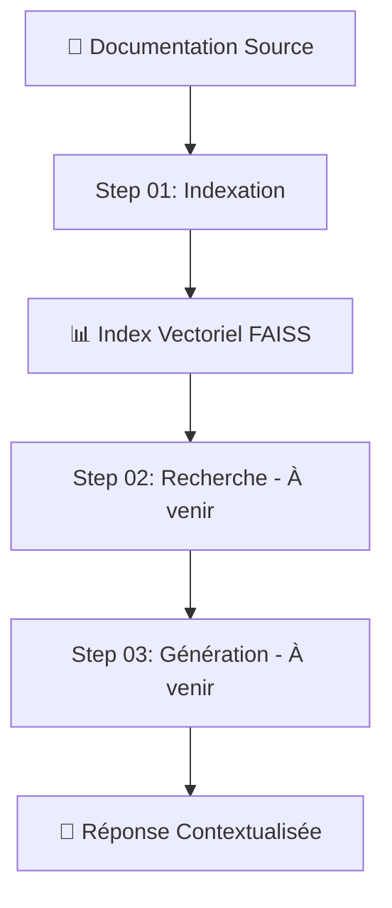

# 🔍 LocalRAG - Système RAG Local Complet

## Vue d'ensemble

LocalRAG est un système de **Retrieval-Augmented Generation (RAG)** entièrement local, conçu pour indexer et interroger efficacement de la documentation technique. Le système fonctionne en plusieurs étapes orchestrées pour offrir une recherche sémantique haute performance sans dépendance cloud.

## 🏗️ Architecture du processus



## 📋 Étapes du processus

### ✅ **Step 01 - Indexation** (`step01_indexer.py`)
**Statut**: ✅ Implémenté et optimisé

Transform la documentation brute en index vectoriel searchable.

---

## 🚀 Step 01 - Indexation Vectorielle

### 🎯 **Objectif**
Convertir la documentation technique (HTML/Markdown) en représentations vectorielles pour permettre une recherche sémantique ultra-rapide.

### 📊 **Pipeline de traitement**


#### 1. **Découverte et Parsing** 
- Scan récursif des répertoires
- Support multi-format : `.html`, `.htm`, `.md`, `.markdown`
- Parser unifié avec gestion d'erreurs robuste
- Extraction du contenu, titres, sections, images et liens

#### 2. **Segmentation Intelligente**
- Découpage en chunks sémantiquement cohérents
- Préservation du contexte (titre, section parent)
- Optimisation de la taille pour les modèles d'embedding

#### 3. **Analyse Multimodale**
- **Images** : Analyse automatique avec Ollama (descriptions contextuelles)
- **Liens** : Extraction et catalogage des références
- **Métadonnées** : Enrichissement avec informations structurelles

#### 4. **Génération d'Embeddings**
- **Modèle principal** : `Qwen3-Embedding-4B` (2560 dimensions)
- **Fallback** : `paraphrase-multilingual-MiniLM-L12-v2`
- **Optimisations GPU** : Support MPS (Mac) et CUDA
- **Traitement par batch** adaptatif selon la puissance GPU

#### 5. **Indexation Vectorielle**
- **Backend** : FAISS-HNSW (Facebook AI Similarity Search)
- **Performance** : 10x plus rapide que ChromaDB
- **Persistance** : Sauvegarde automatique sur disque
- **Scalabilité** : Gestion de millions de vecteurs

### 🛠️ **Utilisation**

#### Installation des dépendances
```bash
pip install -r requirements.txt
```

#### Indexation complète
```bash
python step01_indexer.py /path/to/documentation
```

#### Indexation incrémentale (nouveaux fichiers uniquement)
```bash
python step01_indexer.py /path/to/documentation --incremental
```

#### Test sur un fichier unique
```bash
python step01_indexer.py /path/to/documentation --single-file document.html
```

### ⚙️ **Options de configuration**

| Option | Description | Recommandé pour |
|--------|-------------|-----------------|
| `--db-path` | Chemin de l'index FAISS | Personnaliser le stockage |
| `--debug` | Mode debug détaillé | Développement/Debug |
| `--incremental` | Indexation incrémentale | Mises à jour régulières |
| `--no-flash-attention` | Désactive Flash Attention 2 | Mac avec erreurs GPU |
| `--no-reranker` | Désactive le reranker | GPU limité |

### 📈 **Performances**

#### Environnements supportés
- **🍎 Mac M1/M2/M3** : MPS (Metal Performance Shaders)
- **🚀 Linux/Windows** : CUDA (NVIDIA GPU)
- **❌ CPU** : Non supporté (performance insuffisante)

#### Métriques typiques
- **Parsing** : ~100 fichiers HTML/min
- **Embeddings** : ~50 documents/sec (MPS) | ~200 documents/sec (CUDA)
- **Indexation FAISS** : ~1000 vecteurs/sec
- **Mémoire** : ~2GB RAM pour 100k chunks

### 🗃️ **Structure des données**

#### Index FAISS
```
faiss_index/
├── index.faiss          # Index vectoriel HNSW
├── metadata.json        # Métadonnées enrichies
├── mappings.pkl         # Mapping ID ↔ Index
└── tracking.json        # État d'indexation
```

#### Métadonnées par chunk
```json
{
  "source_file": "/path/to/document.html",
  "title": "Guide d'utilisation",
  "heading": "Configuration avancée",
  "content_length": 1247,
  "images_count": 3,
  "links_count": 5,
  "indexed_at": "2024-01-15T14:30:00",
  "chunk_content": "Contenu du segment..."
}
```

### 🔧 **Architecture technique**

#### Classes principales
- **`TechnicalDocIndexer`** : Orchestrateur principal
- **`UniversalDocumentParser`** : Parser unifié HTML/Markdown
- **`VectorIndexer`** : Gestionnaire d'embeddings et FAISS
- **`OllamaImageAnalyzer`** : Analyse multimodale des images
- **`Qwen3Reranker`** : Reranking sémantique (step 02)

#### Flux de données
1. **Fichiers** → **Chunks** (Parser)
2. **Chunks** → **Embeddings** (Qwen3)
3. **Embeddings** → **Index FAISS** (VectorIndexer)
4. **Métadonnées** → **JSON** (Tracking)

### ⚡ **Optimisations**

#### Gestion mémoire
- **Nettoyage automatique** : Cache MPS vidé après chaque batch
- **Batch adaptatif** : Taille ajustée selon GPU et longueur documents
- **Streaming** : Traitement par petits lots pour éviter l'OOM

#### Performance GPU
- **Pas de fallback CPU** : Échec immédiat si GPU indisponible
- **Flash Attention 2** : Accélération des transformers (CUDA)
- **Precision mixte** : FP16 automatique sur GPU compatibles

### 🚨 **Gestion d'erreurs**

#### Robustesse
- **Collecteur d'erreurs** : Catalogage centralisé des échecs
- **Continuation** : Traitement des autres fichiers si un échoue
- **Rapport détaillé** : Statistiques complètes en fin d'exécution

#### Types d'erreurs gérées
- Images manquantes ou corrompues
- HTML malformé
- Timeouts GPU
- Erreurs d'encoding

---

## 📅 **Roadmap**

### 🔄 **Step 02 - Recherche** (À implémenter)
- Interface de recherche sémantique
- Reranking avec Qwen3-Reranker-4B
- Système de scoring hybride
- Cache de requêtes fréquentes

### 🤖 **Step 03 - Génération** (À implémenter)  
- Intégration LLM local (Ollama/MLX)
- Génération de réponses contextualisées
- Templates de prompts optimisés
- Streaming des réponses

### 🔧 **Step 04 - Interface** (À implémenter)
- API REST/FastAPI
- Interface web interactive
- Chat en temps réel
- Visualisation des résultats

---

## 🛡️ **Sécurité et confidentialité**

- **100% Local** : Aucune donnée envoyée vers des services externes
- **Chiffrement** : Index FAISS peut être chiffré au repos
- **Isolation** : Traitement en sandbox local
- **Contrôle total** : Vos données restent sur votre infrastructure

---

## 🤝 **Contribution**

Le projet suit une architecture modulaire permettant des contributions ciblées :
- **Step 01** : Optimisations d'indexation
- **Step 02+** : Nouvelles étapes du pipeline
- **Parsers** : Support de nouveaux formats
- **Backends** : Intégration d'autres bases vectorielles

---

## 📊 **Statistiques d'utilisation**

Après indexation, le script affiche :
- Nombre de fichiers traités
- Chunks générés et indexés
- Images analysées
- Erreurs rencontrées
- Temps de traitement total
- Taille de l'index final

**Exemple** :
```
✅ Indexation terminée !
📊 Statistiques finales :
   - Fichiers traités : 1,247
   - Chunks générés : 12,458  
   - Images analysées : 3,891
   - Vecteurs indexés : 12,458
   - Erreurs : 23 (1.8%)
   - Durée totale : 4min 32s
   - Index FAISS : 2.1 GB
```